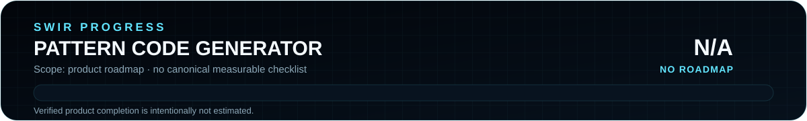

<!-- SWIR-README-STANDARD:v2 -->

<div align="center">


<br>


[](https://github.com/Swir)
[](https://github.com/Swir/keygenerator/stargazers)

[**Highlights**](#-highlights) · [**Quick Start**](#-quick-start) · [**Usage**](#-usage) · [**Releases**](#-releases)

</div>

<p align="center">
  
</p>

**Product roadmap progress:** N/A — this repository does not contain a canonical checklist or weighted roadmap from which software completion can be reproduced.


## 📍 Project Status

| Item | Status |
|---|---|
| Current stage | Stable small desktop utility |
| Platform | Windows release; Python/Tk source |
| Latest public release | [v1.0.0](https://github.com/Swir/keygenerator/releases/tag/v1.0.0) |
| Main purpose | Generate synthetic strings that preserve a selected template shape |
| Product roadmap | No canonical measurable roadmap |

## 🚀 Overview

**Pattern Code Generator** is a lightweight Tkinter desktop utility for producing synthetic strings based on reusable templates. Alphabetic and numeric characters are varied while separators and overall format are preserved. Users can save custom patterns to JSON, generate batches of ten variants, compare them with the source template and copy individual results.

The repository name is historical. The application is a **template-shaped random/test-data generator**; it does not create, recover, validate or activate genuine commercial software licenses, access tokens, credentials or other authorization secrets.

<div align="center">

</div>

## ✨ Highlights

| Feature | What it does |
|---|---|
| 🧩 Template selection | Uses saved string formats as generation patterns. |
| ➕ Custom patterns | Adds user-defined patterns and stores them in `patterns.json`. |
| 🔟 Batch generation | Produces ten variants per run in the current GUI. |
| 📊 Similarity score | Shows positional similarity between each generated value and the chosen template. |
| 🏆 Best match | Highlights the generated value with the highest similarity in the batch. |
| 📋 Clipboard | Copies a selected synthetic value directly from the GUI. |
| 🧵 Background generation | Runs generation in a worker thread so the button action does not block the UI loop. |

## ⚙️ Quick Start

### Recommended — Windows release

Download the verified public release:

[**Pattern Code Generator v1.0.0 →**](https://github.com/Swir/keygenerator/releases/tag/v1.0.0)

The release provides `Key-Generator.exe`, a Windows x64 ZIP and a SHA-256 checksum file.

### From source

```bash
git clone https://github.com/Swir/keygenerator.git
cd keygenerator
python generator.py
```

The source uses Python's standard-library modules plus Tkinter. Your Python installation must include Tk support.

## 📋 Requirements / Compatibility

- Python 3 with Tkinter when running from source.
- Windows x64 for the published packaged executable/ZIP.
- Write access to the working directory if you want custom patterns persisted in `patterns.json`.

## 🎮 Usage

1. Select an existing pattern or type a new one.
2. Add the custom pattern if you want it saved.
3. Click **Generate codes**.
4. Review the ten generated variants and their similarity values.
5. Copy any result with its **Copy** button.

The generator preserves non-alphanumeric separators and varies nearby alphabetic/numeric characters around the source pattern. Similarity is a simple positional comparison; it is not a validity, license or cryptographic score.

## 🧠 Technology / Architecture

| Layer | Technology / role |
|---|---|
| GUI | Tkinter / ttk |
| Generation | Python `random` with template-character transforms |
| Pattern storage | Local JSON file (`patterns.json`) |
| Packaging | GitHub Actions Windows release workflow |

## 🗺️ Roadmap

<p align="center">
  
</p>

No authoritative product roadmap is currently present. The progress graphic therefore reports **N/A** instead of treating the v1.0.0 release or file count as software completion.

## 📦 Releases

Latest verified public release:

- **v1.0.0** — Windows executable, portable ZIP and SHA-256 checksum.

[**Browse GitHub Releases →**](https://github.com/Swir/keygenerator/releases)

## ⚠️ Limitations / Responsible Use

- Generated strings are synthetic test data derived from user-selected patterns.
- A high similarity score only means more characters match the template in the same positions.
- The tool does not query activation servers, reverse engineer licensing systems, validate credentials or bypass access controls.
- Do not present generated strings as genuine licenses, credentials or authorization secrets.

## 🔎 Search Keywords

`random code generator python` • `pattern string generator` • `template based test data` • `Tkinter random generator` • `synthetic serial format generator` • `JSON pattern generator` • `desktop code generator` • `batch random strings` • `template similarity score` • `Windows Python utility`


<div align="center">

### `DEFINE • GENERATE • COMPARE • COPY`

⭐ **If this project is useful, consider leaving a star.**

[**← SWIR profile**](https://github.com/Swir) · [**All projects →**](https://github.com/Swir?tab=repositories)

</div>
